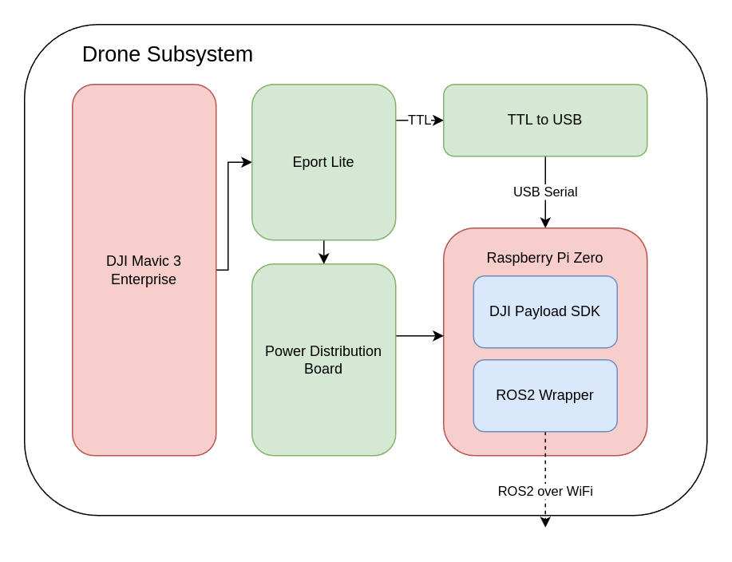
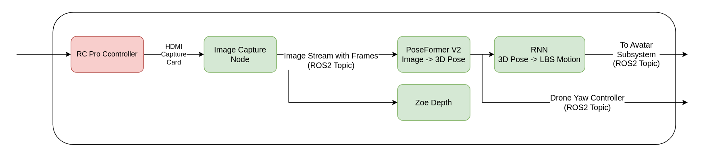
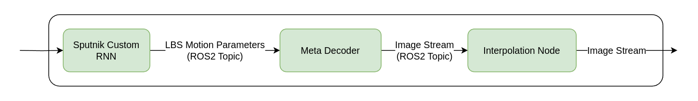

# perception
Perception node for Sputnik that converts from raw image and decodes the pose

Each of the nodes have their own tasks to perform, and they are as follows:
1. ImageCapture - Captures the image from the camera and publishes it to the topic /captured_image
2. Pose3D - Decodes the pose from the image and publishes the decoded pose and the lbs_motion parameters
3. Decoder - Decodes the lbs_motion parameters and publishes the textured image
4. Interpolator - Interpolates the images to improve the framerate
5. The currentv code for VR headset visualization(Not Finished) is contained in vr_codes. receive_pose.py stream the poses of both eyes 
from the headset to the desktop. stream_image.py stream the renderered left/right eye images to the headset.
The nodes are connected in the following way:

- For the drone assets please refer to sputnik/drone repository
- For the avatar assets please refer to audio2photoreal repository
- For the Pose3D Node please refer to instructions for PoseFormerV2
- For the RNN please send an email to the author of the repository